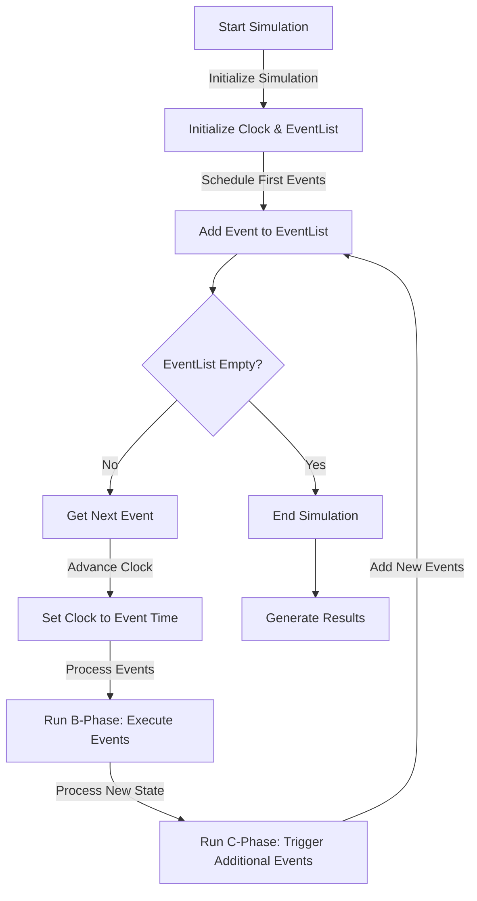

```mermaid
graph TD
    A[Start Simulation] -->|Initialize Simulation| B[Initialize Clock & EventList]
    B -->|Schedule First Events| C[Add Event to EventList]
    C --> D{EventList Empty?}
    D -->|No| E[Get Next Event]
    E -->|Advance Clock| F[Set Clock to Event Time]
    F -->|Process Events| G[Run B-Phase: Execute Events]
    G -->|Process New State| H[Run C-Phase: Trigger Additional Events]
    H -->|Add New Events| C
    D -->|Yes| I[End Simulation]
    I --> J[Generate Results]


```