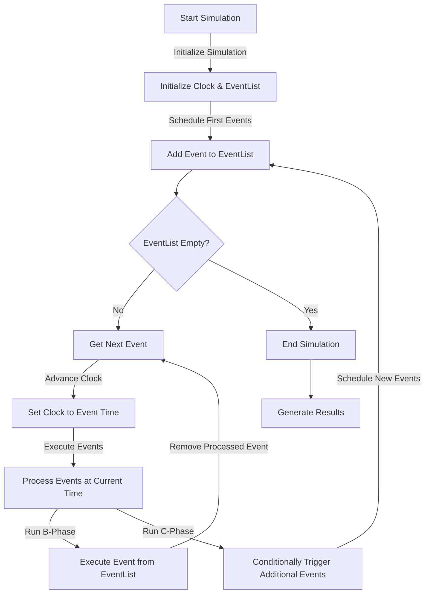

```mermaid
graph TD
    A[Start Simulation] -->|Initialize Simulation| B[Initialize Clock & EventList]
    B -->|Schedule First Events| C[Add Event to EventList]
    C --> D{EventList Empty?}
    D -->|No| E[Get Next Event]
    E -->|Advance Clock| F[Set Clock to Event Time]
    F -->|Execute Events| G[Process Events at Current Time]
    G -->|Run B-Phase| H[Execute Event from EventList]
    G -->|Run C-Phase| I[Conditionally Trigger Additional Events]
    H -->|Remove Processed Event| E
    I -->|Schedule New Events| C
    D -->|Yes| J[End Simulation]
    J --> K[Generate Results]

```