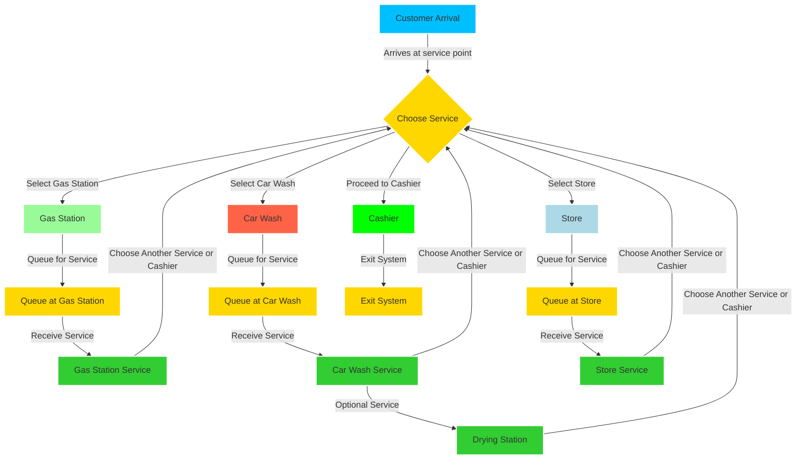

```mermaid
graph TD
    A[Customer Arrival] -->|Arrives at service point| B{Choose Service}
    B -->|Select Gas Station| C[Gas Station]
    B -->|Select Car Wash| D[Car Wash]
    B -->|Select Store| F[Store]
    
    C -->|Queue for Service| G[Queue at Gas Station]
    D -->|Queue for Service| H[Queue at Car Wash]
    F -->|Queue for Service| J[Queue at Store]
    
    G -->|Receive Service| K[Gas Station Service]
    H -->|Receive Service| L[Car Wash Service]
    L -->|Optional Service| M[Drying Station]
    J -->|Receive Service| O[Store Service]
    
    K -->|Choose Another Service or Cashier| B
    L -->|Choose Another Service or Cashier| B
    M -->|Choose Another Service or Cashier| B
    O -->|Choose Another Service or Cashier| B
    
    B -->|Proceed to Cashier| P[Cashier]
    P -->|Exit System| Q[Exit System]
    
    style A fill:#00BFFF,stroke:#FFFFFF,stroke-width:2px
    style B fill:#FFD700,stroke:#FFFFFF,stroke-width:2px
    style C fill:#98FB98,stroke:#FFFFFF,stroke-width:2px
    style D fill:#FF6347,stroke:#FFFFFF,stroke-width:2px
    style F fill:#ADD8E6,stroke:#FFFFFF,stroke-width:2px
    style G fill:#FFD700,stroke:#FFFFFF,stroke-width:2px
    style H fill:#FFD700,stroke:#FFFFFF,stroke-width:2px
    style J fill:#FFD700,stroke:#FFFFFF,stroke-width:2px
    style K fill:#32CD32,stroke:#FFFFFF,stroke-width:2px
    style L fill:#32CD32,stroke:#FFFFFF,stroke-width:2px
    style M fill:#32CD32,stroke:#FFFFFF,stroke-width:2px
    style O fill:#32CD32,stroke:#FFFFFF,stroke-width:2px
    style P fill:#00FF00,stroke:#FFFFFF,stroke-width:2px
    style Q fill:#FFD700,stroke:#FFFFFF,stroke-width:2px


```